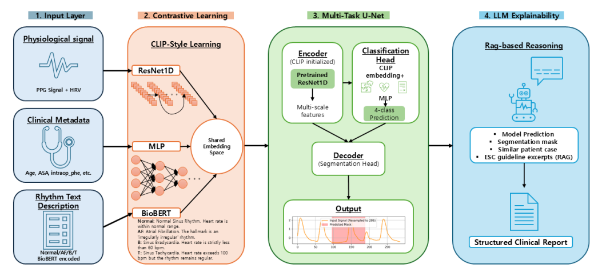
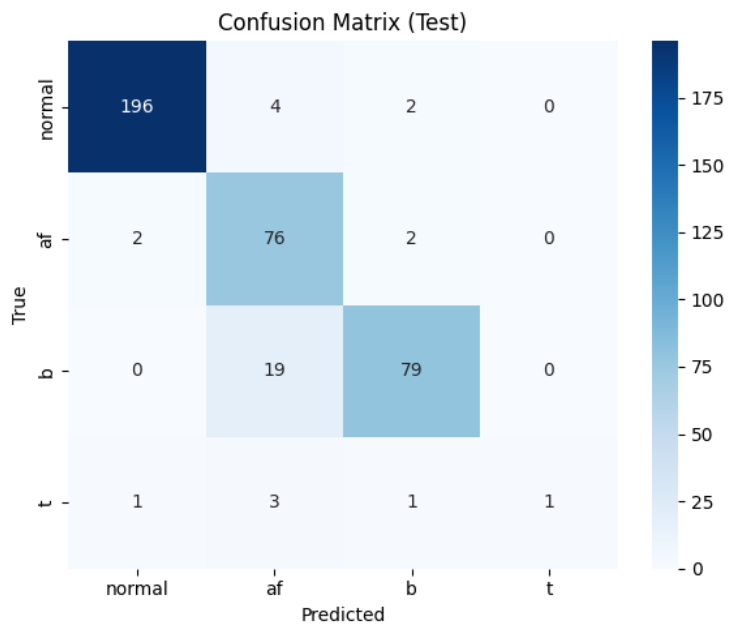
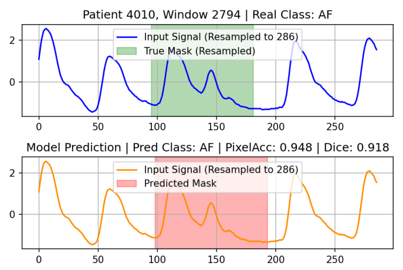
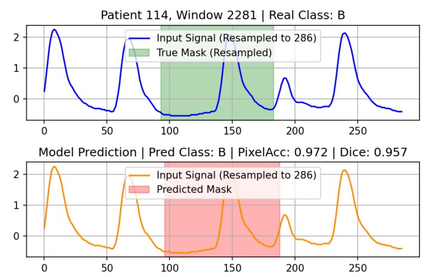
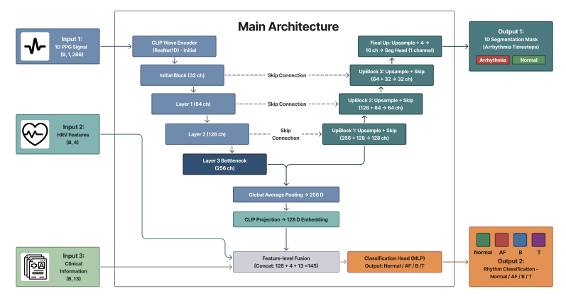
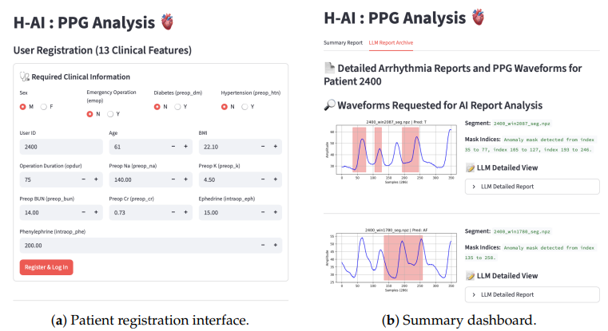
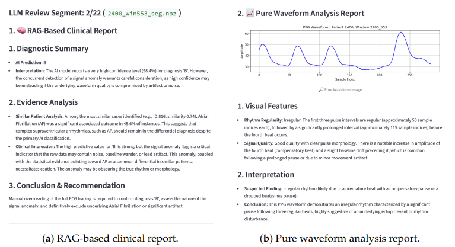

# 🌟 Multimodal PPG-Based Arrhythmia Detection Using a CLIP-Initialized Multi-Task U-Net and LLM-Assisted Reporting

PPG(광용적맥파, Photoplethysmography) 신호만으로 부정맥을 탐지·구간분할하고, LLM이 근거 기반 진단 리포트까지 생성하는 end-to-end 멀티모달 프레임워크입니다. 웨어러블 기기에서도 흔히 확보 가능한 PPG 신호를 활용해, ECG 없이도 임상적으로 유의미한 부정맥 스크리닝이 가능함을 보이는 것을 목표로 합니다.

이 저장소는 MDPI **Sensors**(SCIE)에 게재된 논문의 공식 구현체입니다.

📄 **논문**: [MDPI Sensors 2026, 26, 2316](https://www.mdpi.com/1424-8220/26/8/2316)
📊 **데이터셋**: [Kaggle - PPG Arrhythmia Dataset](https://www.kaggle.com/datasets/minhwannoh/ppg-arrhythmia-dataset)

---

## 🏆 성과

- 동국대학교 졸업작품(종합설계) **A+**
- **한국저작권위원회 소프트웨어 등록**
- MDPI **Sensors**(SCIE) 공동 제1저자(Co-first author) 논문 게재

---

## 프로젝트 개요

기존 웨어러블 기반 PPG 부정맥 탐지 시스템은 다음과 같은 한계를 가지고 있습니다.

- 대부분 심방세동(AF) 탐지에만 특화되어 있고, 서맥(Bradycardia)·빈맥(Tachycardia)은 잘 다루지 않음
- 이상 구간이 어디인지 시간축 상에서 짚어주는 segmentation 기능이 거의 없음
- 딥러닝 모델의 예측 근거가 불투명해(black-box) 임상 현장에서 신뢰하기 어려움

본 프로젝트는 이 세 가지 문제를 하나의 파이프라인으로 해결합니다.

1. **CLIP 스타일 대조학습**으로 PPG 파형·임상 정보(13개 변수)·BioBERT 기반 리듬 설명 텍스트를 하나의 임베딩 공간에 정렬
2. 이 인코더로 초기화한 **멀티태스크 1D U-Net**이 4-class 분류(Normal/AF/서맥/빈맥)와 이상 구간 segmentation을 동시에 수행
3. 모델 예측·유사 환자 검색 결과·ESC 가이드라인 발췌를 근거로 **RAG 기반 LLM(Gemini)**이 구조화된 진단 리포트를 생성
4. 이 전체 파이프라인을 **Streamlit 웹 서비스**로 배포해 업로드→추론→시각화→리포트 생성까지 실시간으로 제공

<p align="center">
  
  <br>
  <sub>1. 입력(PPG+HRV, 임상 정보, 리듬 텍스트) → 2. CLIP 대조학습 → 3. 멀티태스크 U-Net → 4. RAG 기반 LLM 리포팅</sub>
</p>

---

## 역할

| 이름 | 역할 |
|---|---|
| **허영호**(공동 제1저자) | Methodology, Software, Validation, Formal Analysis, Investigation, Data Curation, Writing, Visualization |
| **노민환**(공동 제1저자) | Methodology, Software, Validation, Formal Analysis, Investigation, Data Curation, Writing, Visualization |
| 지동우 | Methodology, Validation, Investigation, Writing |
| 오유나 | Methodology, Investigation, Writing |

---

## 핵심 성능 지표

VitalDB 기반 테스트셋(5명 환자, 386개 세그먼트) 기준, 베이스라인(PPG+HRV만 사용하는 멀티태스크 U-Net) 대비 제안 모델(CLIP 사전학습 + HRV + 임상 정보 결합)의 성능입니다.

### 분류 성능

| Model | Accuracy | Normal F1 | AF F1 | Bradycardia F1 | Tachycardia F1 |
|---|---|---|---|---|---|
| U-Net Baseline | 0.8627 | 0.9452 | 0.7940 | 0.7778 | 0.6000 |
| **제안 모델** | **0.9119** | **0.9775** | **0.8352** | **0.8681** | 0.2857 |

### Segmentation 성능

| Model | Pixel Accuracy | Dice | IoU |
|---|---|---|---|
| U-Net Baseline | 0.8983 | 0.5815 | 0.4213 |
| **제안 모델** | **0.9344** | **0.7167** | **0.5902** |

Accuracy는 **86.27% → 91.19%**, Dice는 **0.5815 → 0.7167**로 개선되었습니다. 단, Tachycardia는 테스트셋 내 표본이 6개뿐인 극심한 클래스 불균형으로 인해 성능이 저하되었으며, 논문에서도 이를 구조적 한계가 아닌 표본 부족의 영향으로 명시하고 있습니다.

### Ablation Study

| Configuration | Accuracy | Dice |
|---|---|---|
| U-Net (HRV/임상 정보 미사용) | 0.8254 | 0.5532 |
| U-Net + 임상 정보만 | 0.8541 | 0.5795 |
| U-Net + HRV만 | 0.8627 | 0.5815 |
| **U-Net + CLIP + HRV + 임상 정보 (제안 모델)** | **0.9119** | **0.7167** |

<p align="center">
  
</p>

<p align="center">
  
  
</p>

---

## 시스템 아키텍처

**1단계 — CLIP-BioBERT 대조학습 사전훈련**
1D ResNet 기반 파형 인코더, MLP 기반 임상 정보 인코더, BioBERT 기반 리듬 텍스트 인코더를 InfoNCE loss로 공동 학습해 하나의 128차원 임베딩 공간에 정렬합니다.

**2단계 — CLIP 인코더 초기화 멀티태스크 U-Net**
사전학습된 ResNet 인코더를 U-Net의 인코더(백본)로 전이학습(Transfer Learning)시킵니다. 인코더는 초기 몇 epoch 동안 동결한 뒤 점진적으로 fine-tuning합니다. 인코더 병목 특징(256d) → CLIP 임베딩(128d)에 HRV(4d)·임상 정보(13d)를 결합한 145차원 벡터로 4-class 분류를, 디코더 경로로 이상 구간 segmentation을 동시에 수행합니다.

**3단계 — RAG 기반 LLM 설명가능성**
모델 예측·segmentation mask·유사 환자 검색 결과·ESC 가이드라인 발췌를 근거로 Gemini LLM이 구조화된 임상 리포트를 생성합니다. LLM은 학습에 관여하지 않고 사후 설명(post-hoc explainability) 용도로만 사용됩니다.

<p align="center">
  
</p>

---

## 저장소 구조

이 저장소는 크게 **연구용 학습 스크립트(Colab 노트북 export)** 와 **실제 서비스에 사용되는 정제된 추론 모듈**로 나뉩니다.

| 파일 | 역할 | 성격 |
|---|---|---|
| `Contrastive_Learning.py` | PPG 파형 ↔ 임상 정보 ↔ BioBERT 텍스트를 CLIP 방식으로 대조학습(InfoNCE)시키는 사전학습 스크립트. RAG용 유사 환자 검색 DB(`knowledge_base.pt`) 생성도 포함 | 학습 스크립트 (Colab export) |
| `U_Net.py` | PPG 파형+HRV만으로 분류·segmentation을 수행하는 베이스라인 멀티태스크 1D U-Net 학습 스크립트 | 학습 스크립트 (Colab export) |
| `Final.py` | CLIP 사전학습 인코더를 U-Net에 전이학습시킨 최종 결합 모델 학습 스크립트. 데이터 전처리, 학습 루프, RAG 조회, LLM 리포트 프로토타입까지 포함된 메인 실험 파일 | 학습 스크립트 (Colab export, 최대 규모) |
| `model_architecture.py` | 최종 모델 구조(`UNet1D_ResNet_Combined` 등)와 추론용 전처리 함수만 추출한 모듈 | 추론 모듈 (`app.py`가 import) |
| `llm_utils.py` | Gemini LLM 연동, RAG 검색용 인코더 클래스, 부정맥 유형별(AF/T/B/Normal) 의료 가이드라인 텍스트 | 추론 모듈 (`app.py`가 import) |
| `app.py` | Streamlit 웹 서비스: 회원가입/로그인(SQLite), PPG 업로드 → 추론 → 시각화, RAG 기반 LLM 리포트 생성, 분석 이력 관리 | 서비스 진입점 |

`Contrastive_Learning.py` / `U_Net.py` / `Final.py`는 Colab 노트북을 그대로 옮긴 학습 기록이라 로컬에서 곧바로 실행되지는 않으며, 모델 개발 과정과 근거 자료로서 남겨두었습니다. 실제로 동작하는 추론·서비스 스택은 `model_architecture.py` + `llm_utils.py` + `app.py`입니다.

### 데이터 및 산출물

| 파일 | 용도 |
|---|---|
| `best_combined_model.pth` | 최종 결합 모델 가중치 |
| `knowledge_base.pt` | RAG용 유사 환자 임베딩 DB |
| `data_stats.json` / `clinical_stats.json` | 정규화용 통계치 (전처리 시 참조) |
| `PPG_data.zip` | 샘플 PPG 데이터셋 |

---

## 데모

<p align="center">
  
</p>

환자는 13개 임상 변수와 함께 등록하고, PPG 세그먼트를 업로드하면 모델이 실시간으로 4-class 분류와 이상 구간 segmentation을 수행해 대시보드에 정리해 보여줍니다.

<p align="center">
  
</p>

이상 세그먼트에 대해 "Deep Diagnosis"를 요청하면 (1) 유사 환자 통계 기반 RAG 리포트와 (2) 파형 이미지를 직접 분석하는 Vision 기반 리포트, 두 가지를 생성해 진단 근거를 함께 제시합니다.

---

## 기술 스택

- **딥러닝**: PyTorch, transformers (BioBERT)
- **신호 처리**: NumPy, SciPy (`find_peaks` 기반 HRV 특징 추출)
- **LLM / RAG**: Google Gemini API (`google-generativeai`)
- **웹 서비스**: Streamlit
- **데이터베이스**: SQLite
- **기타**: pandas, scikit-learn, python-dotenv

---

## 실행 방법

```bash
git clone <this-repo>
cd ppg-arrhythmia-detection

# 1. Gemini API 키 설정
cp .env.example .env
# .env 파일을 열어 GEMINI_API_KEY 값을 채워 넣습니다.

# 2. 필요 패키지 설치
pip install -r requirements.txt

# 3. 웹 앱 실행
streamlit run app.py
```

Gemini API 키는 [Google AI Studio](https://aistudio.google.com/)에서 발급받을 수 있으며, `.env` 파일은 `.gitignore`에 등록되어 있어 커밋되지 않습니다.

---

## 한계 및 향후 과제

- 단일 기관(서울대학교병원, VitalDB) 수술실 환경에서 수집된 데이터로만 검증되어, 다기관·실사용 웨어러블 환경에서의 일반화 성능은 추가 검증이 필요합니다.
- LLM이 생성한 리포트는 근거 기반(RAG)으로 제약되어 있지만, 전문의의 정식 검증을 거치지 않았으므로 보조적 참고 자료로만 사용해야 합니다.
- Tachycardia 클래스의 표본 수가 극히 적어(테스트셋 6개) 해당 클래스 성능 지표는 예비적(preliminary) 결과로 해석해야 하며, 데이터 증강이나 클래스 불균형 완화 기법이 향후 과제로 남아 있습니다.

---

## 인용

```bibtex
@article{huh2026multimodal,
  title   = {Multimodal PPG-Based Arrhythmia Detection Using a CLIP-Initialized Multi-Task U-Net and LLM-Assisted Reporting},
  author  = {Huh, Youngho and Noh, Minhwan and Ji, Dongwoo and Oh, Yuna and Sun, Sukkyu},
  journal = {Sensors},
  volume  = {26},
  number  = {8},
  pages   = {2316},
  year    = {2026},
  publisher = {MDPI},
  doi     = {10.3390/s26082316}
}
```

## 라이선스

이 프로젝트는 [MIT License](LICENSE)를 따릅니다.
